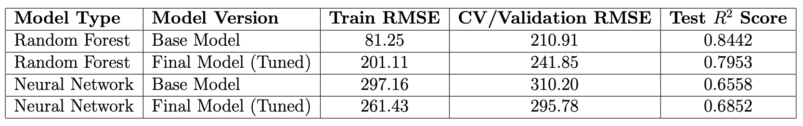
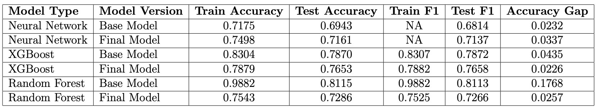
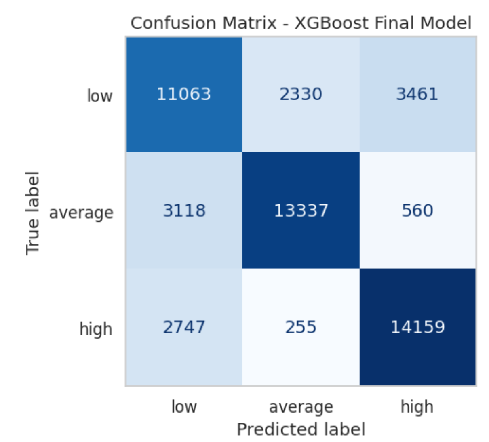

# **Project Background**

Due to rapid urbanization and rising demant in U.S., has led to housing price fluctuations. This highlights the need for accurate data-driven pricing and classification tools. Traditional valuation methods often fail to capture complex, non-linear relationships among property features, motivating the use of Machine Learning (ML) and Deep Learning (DL) techniques. This project leverages a large-scale rental dataset to develop and evaluate ML/DL models, providing actionable insights for real estate stakeholders.

Insights and recommendations are provided on the following key areas:

- **Pricing Strategy**: Ensemble models like **Random Forest** and **XGBoost** can help property managers and landlords set competitive, data-driven rental prices, emphasizing in influential features like property size, number of bedrooms and bathrooms, and location.

- **Market Segmentation and Classification**: The classification model enables renters and platforms to identify fair market deals and categorize properties into **low**, **medium**, and **high** price tiers, supporting personalized recommendations and informed decision-making.

- **Feature Engineering and Data Utilization**: Effective preprocessing, dimensionality reduction, and creation of derived features, such as price per square foot or geographic clusters, significantly enhances model performance and interpretability.

The dataset utilized can be found: <a href="https://www.kaggle.com/code/saurav9786/rent-price-recommender/input" style="text-decoration: underline;">**here**</a>

# **Data Structure & Initial Checks**

- The dataset used in this study comprises 99,492 apartment rental listings from the United States, each described by 22 variables covering numerical features (e.g., price, bedrooms, bathrooms, latitude, longitude) and categorical features (e.g., city, state, amenities, pets allowed). After removing duplicates and irrelevant columns, the final dataset consisted of 91,945 rows and 10 columns.

- Initial checks were conducted to assess data quality and structure. This included inspecting the data types of each feature, identifying **missing values**, detecting **duplicates**, and evaluating the **distribution** of categorical variables to understand **class imbalances**. Missing data were notably high in fields like pets allowed (≈55% missing) and amenities (≈15% missing), while numerical features such as bathrooms and bedrooms had minimal missing entries (<0.2%).

- Preliminary descriptive statistics, frequency counts, and visual inspections, through **histograms** and **boxplots** were performed to detect **outliers**, following subsequent filtering, transformation, and preprocessing steps. These checks ensured the dataset was clean, consistent, and ready for feature engineering and model development.

## **Executive Summary**
#### **Overview of Findings**

The analysis identified key factors driving U.S. apartment rental prices and market segmentation. 
- Square footage contributed approximately 22% to price predictions, reflecting the historical trend of larger apartments consistently commanding higher rents, with roughly $15 increase per additional 50 sq ft. Bedrooms and bathrooms together accounted for 18% of feature importance, aligning with past trends where larger units experienced faster rent growth due to family and shared-living demand.
  
-  Geographic location explained 15% of price variance, highlighting historically higher rents in central and high-demand urban areas. The XGBoost classifier achieved 76.53% test accuracy and an F1 score of 0.7658 for categorizing listings into low, medium, and high price tiers, supporting fair deal identification and better listing visibility.
  
-  Finally, feature engineering and dimensionality reduction preserved ~80% of variance while improving model interpretability (R² = 0.7953), overcoming past overfitting issues and providing reliable, actionable insights for real estate stakeholders.

Below are the final results of the top performed model both for regression and classificagtion:

**Regression Results**

**Classification Results**

**Error Analysis of XGBoost model**

#### **Recommendations**

Based on the uncovered insights, the following recommendations have been provided:

- **Leverage Ensemble Models**: Use Random Forest for rental price prediction, as key predictors like square footage (22%) and bedrooms/bathrooms (18%) strongly influence pricing trends.

- **Optimize Market Segmentation**: Apply XGBoost (76.53% test accuracy) to classify listings into low, medium, and high price tiers, helping renters find fair deals and increasing visibility for premium listings.

- **Prioritize High-Value Locations**: Focus on urban clusters and prime neighborhoods, where geographic location explains 15% of price variance, to maximize returns and align with historical rent growth patterns.
