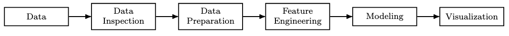
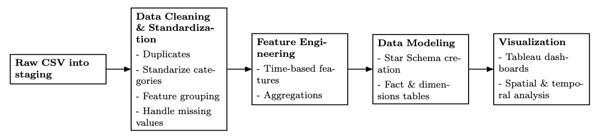
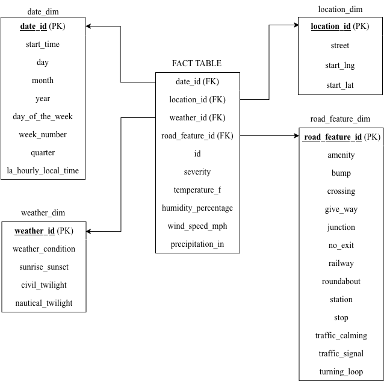
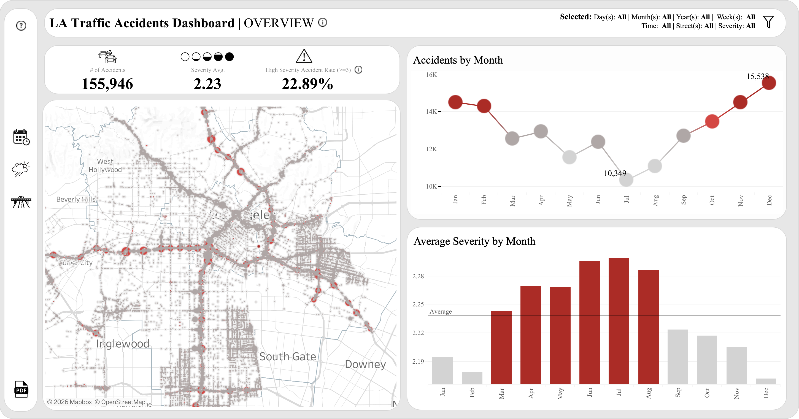

## **Links**

To see the LA Traffic Accidents Dashboard please press <a href="https://public.tableau.com/views/LATrafficAccidentsDashboard/DashboardMain?:language=en-US&:sid=&:display_count=n&:origin=viz_share_link" style="text-decoration: underline;">**here**</a>

# **Project Scope and Objectives**

This project analyzes traffic accident frequency and severity in Los Angeles using historical accident data from February 2016 to March 2023.

The analysis focuses on temporal patterns, weather and light conditions, and road infrastructure features to identify patterns in accident frequency and severity

The analysis is descriptive and exploratory. It does not claim causality.

# **Data Source**

The dataset is US Accidents 2016 to 2023, published on Kaggle and compiled by Sobhan Moosavi.

The raw dataset contains millions of records across 49 US states, but for this project's purposes, only accidents recorded in Los Angeles have been filtered.

The dataset utilized can be found <a href="https://www.kaggle.com/datasets/sobhanmoosavi/us-accidents" style="text-decoration: underline;">**here**</a>

# **Preprocess & Copnceptual framework**
- Raw CSV
- Python initial inspection and filtering
- PostgreSQL staging and cleaning
- Feature engineering
- Star schema
- CSV export
- Tableau dashboard

**Conceptual Framework**

**Data Analysis Process**

# **Star Schema**

## **Executive Summary**
This project develops an interactive dashboard about traffic accidents in Los Angeles with key metrics like number of accidents, average severity, and high severity accident rate into a unified, actionable tool. The dashboard enables traffic authorities in Los Angeles to identify high risk periods and locations by revealing patterns in accident frequency and severity across time, weather, and road infrastructure.

Dashboard Overview

#### **Overview of Findings**
- Accidents occur most frequently between 04:00 and 08:00.
- High frequency periods do not align with high severity periods.
- Clear weather and daylight show the highest accident frequency.
- Low visibility conditions, such as cloudy and fog or mist, are linked to higher average severity.
- Complex road infrastructure combinations, such as exit plus railway plus station, are associated with higher severity.

#### **Recommendations**
- Focus enforcement and monitoring on low visibility conditions, not only peak traffic hours.
- Improve lighting, signage, and warnings in areas with complex infrastructure.
- Treat frequency and severity as separate policy targets.

#### **Limitations and scope**
- Only reported accidents are included.
- Unreported incidents are missing and data gaps may exist due to collection issues.
- CSV export limits real time analysis.
