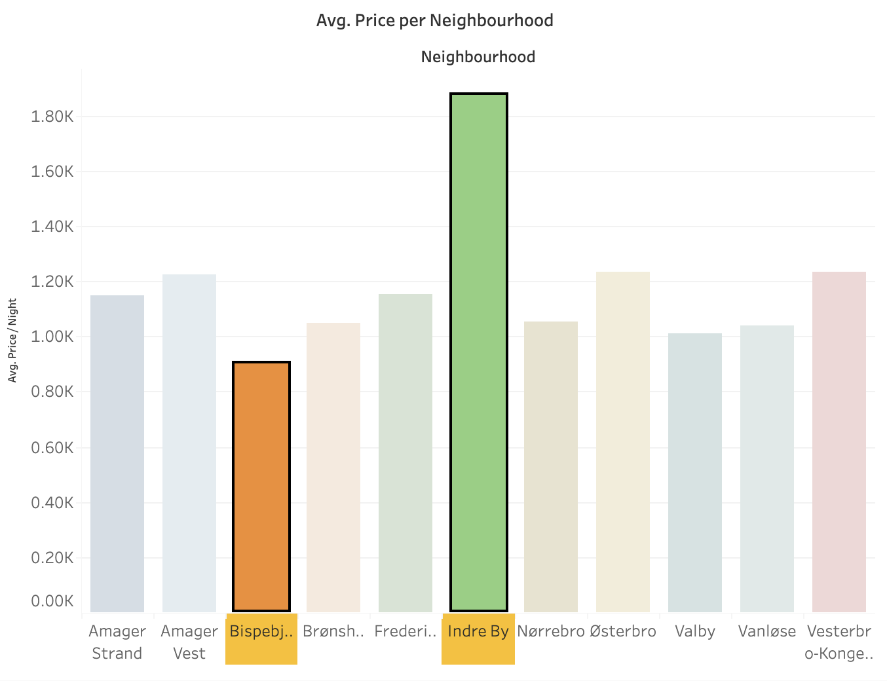

# **Project Background**

The Copenhagen Airbnb market is dynamic and fragmented, making it difficult for management to track pricing, guest satisfaction, and property performance at the same time. This project builds an interactive dashboard that centralizes key metrics—average nightly price, review scores, booking availability, and property type, into a single actionable tool. Features like geographical heatmaps, dynamic filters, and calculated metrics (e.g., Review/Rating Ratio, % of Time Booked) help Airbnb management identify high-performing neighborhoods, optimize pricing, and improve guest satisfaction. The dashboard supports data-driven decisions for both corporate management and property managers, enabling efficient operations and enhanced market competitiveness.

The two datasets utilized, were provided by CBS professors and they are not available online.

# **Data Structure & Initial Checks**

First steps was to work on two datasets on Python before design the dashboard.

- calendar.csv: contains 7,631,731 entries tracking daily availability and price for each listing across 365 days. Columns include listing_id, date, price, and available. No missing values were found, ensuring complete temporal coverage.

- listings.csv: contains 20,909 entries detailing each property, listing_id, name, property_type, review_scores_rating, number_of_reviews, instant_bookable, neighbourhood_cleansed, latitude, and longitude. 3,220 missing values were found in review_scores_rating.

Initial checks included:

- **Duplicates**: no duplicate listing_id found.
  
- **Date ranges**: all listings in calendar.csv cover 365 days, confirming complete yearly data.

These checks ensure that both datasets are consistent, complete, and ready for cleaning and transformation in Python before Tableau integration.

## **Executive Summary**

This project develops an interactive Airbnb dashboard for Copenhagen to centralize key metrics like **pricing**, **guest satisfaction**, and **availability** into a unified, actionable tool. The dashboard enables Airbnb management to optimize performance across neighborhoods and property types by providing insights into **pricing trends**, **guest preferences**, and **market opportunities**.

Key findings include:

- **Pricing variation**: Indre By stands out as a premium location, while Bispebjerg offers cost-effective options.

- **Guest satisfaction trends**: Mid-priced properties often outperform higher-priced ones, highlighting opportunities to adjust pricing models.

- **Instant booking adoption**: Low percentage of properties offering instant booking suggests untapped potential to improve convenience and booking rates.

#### **Overview of Findings**

The Airbnb dashboard analysis reveals key patterns in Copenhagen’s rental market, quantifying insights to inform strategic decisions:

- **Pricing Variation**: Average nightly prices differ significantly across neighborhoods. Indre By averages 1,800 DKK/night, positioning it as a premium area, while Bispebjerg averages 900 DKK/night, appealing to budget-conscious guests. Historical trends show consistent premium pricing in central neighborhoods over the past year.

- **Guest Satisfaction**: Mid-range properties with average review scores of 4.5/5 outperform higher-priced listings, suggesting pricing adjustments could enhance competitiveness. Historically, mid-priced listings have maintained steady high satisfaction scores, indicating a stable opportunity.

- **Occupancy & Booking**: Properties are booked an average of 73% of available days, with instant booking adoption below 20%, revealing potential to increase convenience and revenue. Trends indicate occupancy spikes in summer months, emphasizing the importance of seasonal pricing strategies.

These findings provide a data-driven narrative, highlighting areas for:
- **pricing optimization**,
- **guest experience improvement**, and
- **operational efficiency**.

#### **Recommendations**

- Optimize pricing strategies across neighborhoods.

- Promote instant booking adoption.

- Target resources toward underperforming areas.

